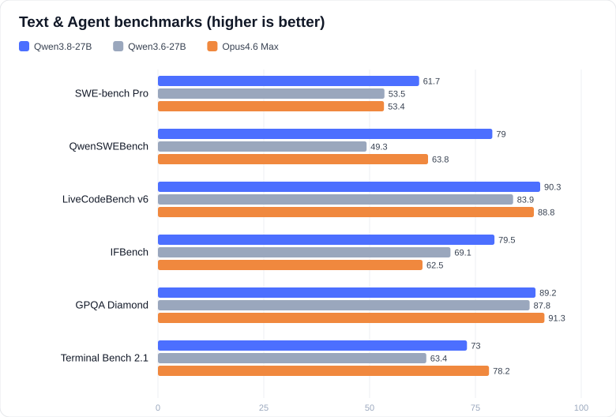
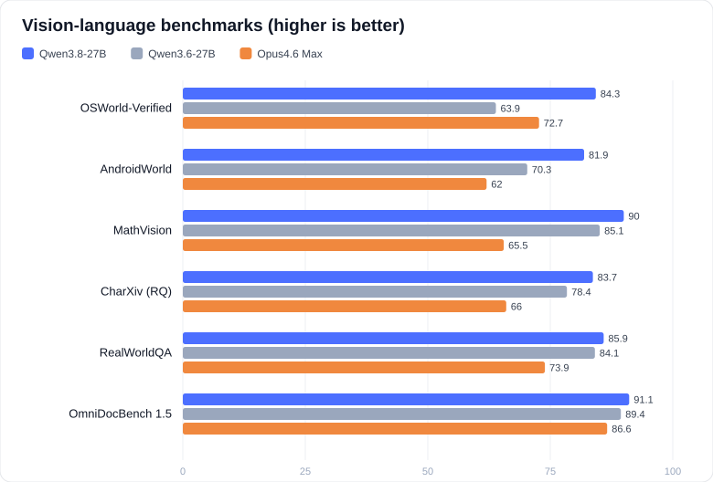

# Qwen3.8-27B (4-bit) on Modal — low cost

Serves `cyankiwi/Qwen3.8-27B-AWQ-INT4` (dense 27B vision-language, reasoning, apache-2.0, ~21GB INT4 weights) via vLLM on a **single A100-80GB**.

## Benchmarks

Charts built from the official [model-card](https://huggingface.co/Qwen/Qwen3.8-27B) scores (Qwen3.8-27B vs its predecessor Qwen3.6-27B and Opus4.6 Max). Regenerate with `python make_benchmark_charts.py`.





## Prerequisites

```
pip install modal openai
modal setup
```

No HF secret needed — the model repo is public.

## Steps

1. **Download weights into a Modal Volume** (CPU only, no GPU cost):
   ```
   modal run download_model.py
   ```
   Idempotent, safe to re-run if interrupted.

2. **Deploy the vLLM server** (1x A100-80GB):
   ```
   modal deploy serve.py
   ```
   Copy the printed endpoint URL (`https://<workspace>--qwen38-27b-serve-serve.modal.run`).

3. **Chat**:
   ```
   python chat.py <endpoint-url>
   ```
   OpenAI-compatible API, so any OpenAI client works (`base_url = <endpoint>/v1`, model `qwen3.8-27b`).

## Cost

| Item | Cost |
|---|---|
| 1x A100-80GB | **~$2.50/hr** (still ~7x cheaper than the 4xH200 GLM-5.2 deploy) |
| Cold boot | a few minutes (weight load + cudagraph capture) |
| Volume storage | free at this size (21GB) |

`max_containers=1` and no keep-warm → scales to zero after 10 min idle; you only pay while serving. Two free volumes persist between runs: `qwen38-27b-awq` (weights, read-only) and `qwen38-27b-vllm-cache` (compile cache, faster reboots).

**Want cheaper?** A 48GB L40S ($1.95/hr) OOMs at default settings — this VL model's live footprint is ~42GB before KV cache. To force it onto an L40S anyway, set `gpu="L40S"` and add `--enforce-eager --max-num-seqs 4 --max-model-len 8192 --limit-mm-per-prompt '{"image":1,"video":0}'` (see comment in `serve.py`). Tighter and slower, but works.

## Notes / knobs

- **Context**: capped at 32K (`MAX_MODEL_LEN` in `serve.py`) to fit KV cache next to the weights on 48GB. Native is 262K; raise if you need it and watch for OOM.
- **Reasoning / tools**: tool calling is on (`--enable-auto-tool-choice --tool-call-parser hermes`) so OpenAI-style `tools` + `tool_choice:"auto"` work. Thinking still streams inline; to split it into `reasoning_content`, add `--reasoning-parser qwen3` in `serve.py`.
- **Vision**: it's a VL model; vLLM accepts images via the OpenAI `image_url` content type out of the box.
- **vLLM version**: pinned to `0.25.1`. If boot fails with an unknown-architecture error, bump the pin in `serve.py` to a release that supports Qwen3.8.
- **FlashInfer sampler**: disabled via `VLLM_USE_FLASHINFER_SAMPLER=0` — it JIT-compiles a CUDA kernel at boot and crashes on the slim image (`Could not find nvcc`). Native Torch sampler is used instead. If another nvcc JIT error appears, switch the image base to `nvidia/cuda:12.8.1-devel` + `CUDA_HOME` (see comment in `serve.py`).

## Important

**Stop the app when done** to avoid idle GPU burn:
```
modal app stop qwen38-27b-serve
```
